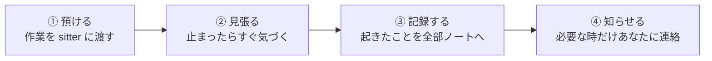

# sitter

<div align="center">

[🇺🇸 English](README.md) ｜ **🇯🇵 日本語** ｜ [🇨🇳 简体中文](README.zh.md) ｜ [🇹🇭 ไทย](README.th.md)


<h4>AI やパソコンに任せた「時間のかかる作業」を、そばで見張ってくれる無料のツールです。</h4>

[](https://github.com/caty-ai/sitter/actions/workflows/ci.yml)
[](LICENSE)

-lightgrey)


[できること](#what) ｜ [必要なもの](#requirements) ｜ [使いはじめる](#start) ｜ [安心の理由](#safety) ｜ [もっと詳しく](#more)

作業がちゃんと終わったか・途中で止まっていないか・返事待ちのまま忘れられていないかを見張り、<br>
何かあったら必ずあなたに知らせます。

**黙って消える作業を、ゼロにします。**

🔧 [エンジニア向けドキュメント](docs/engineering.ja.md) ｜ 📘 [詳細仕様](docs/reference.ja.md)

</div>

---

## こんな経験はありませんか？

1 つでも心当たりがあれば、sitter の出番です。

- AI に頼んだ作業が止まっていて、気づいたのは数時間後だった
- 質問を送ったのに返事が来ないまま、待っていたこと自体を忘れていた
- 夜中に回していた処理が、朝見たら途中から進んでいなかった
- 頼みごとが増えて、どれが動いていてどれが止まっているか追えない

共通する原因はシンプルで、**誰も見張っていない**ことです。
sitter は、この「見張り役」をまるごと引き受けます。

なお sitter は、**ターミナルで動かしている作業**を見張るツールです。アプリ版の ChatGPT や Claude だけを使っている場合は対象外になります。

---

<a id="what"></a>

## sitter がやってくれること

やることは 4 つ。順番もこのままです。



- 👀 **見張る**

  作業が終わったか、途中で固まっていないかを、そばでずっと確認し続けます。

- 📝 **記録する**

  起きたこと（開始・失敗・成功など）をすべて 1 冊のノートに書き残します。実体はただのテキストファイルなので、後から何があったか必ず追えます。

- 🔔 **知らせる**

  人間が知るべきことが起きたときだけ、あなたが決めた方法で連絡します。既定はメモファイルへの追記で、Slack 送信や画面通知にしたい場合はその方法を指定できます。

- ⏰ **返事の催促**

  誰かに質問を投げたまま忘れてしまうのを防ぎます。期限を過ぎたら自動でリマインドし、最後は「そろそろ人間の出番です」と知らせます。

---

<a id="requirements"></a>

## 使うのに必要なもの

新しく買うものはありません。この 3 点だけ確認してください。

- **PC 環境**

  Mac / Linux / Windows（WSL）。ふだんの PC でそのまま動きます。

- **ターミナルから動かしている作業があること**

  sitter は「ターミナルで動かす作業」を見張るツールです。Claude Code・Codex CLI などの AI エージェントから、テスト・ビルド・データ処理まで、**コマンドで動かせるもの**が対象になります。アプリ版の ChatGPT や Claude だけを使っている場合は対象外です。

- **依存・追加費用**

  なし。追加ソフトのインストールもアカウント登録も不要です。なお、見張る相手側のツール（例: Claude Code）の利用料金は別です。

詳しくは[対応環境の一覧表](docs/engineering.ja.md#対応環境)へ。

---

<a id="start"></a>

## 使いはじめる

入れ方は 2 通りあります。**ターミナルで動く AI エージェント**（Claude Code・Codex CLI など）を使っているなら、頼んでしまうのが一番早いです。

> **メモ:** ここでいう Claude Code は、アプリ版の Claude とは別の、ターミナルで動く開発者向けツールです。アプリ版しか使っていない場合は、下の「自分で入れる」へ進んでください。

### AI に入れてもらう

いま使っている AI エージェントに、このページの URL を渡してこう頼むだけです。

```text
https://github.com/caty-ai/sitter
このツールをインストールして、使い方を教えて
```

sitter はファイル 1 個の小さなツールなので、たいていのエージェントはそのまま導入まで済ませてくれます。うまくいかないときは、下の手順を自分で実行してください。

### 自分で入れる

3 ステップです。まずターミナルを開いてください。Mac なら「アプリケーション → ユーティリティ → ターミナル」にあります。Windows の方は先に [Windows での使い方](docs/engineering.ja.md#windows-対応)をご覧ください。以下のコマンドをコピーして貼り付け、Enter を押すだけで進みます。

sitter の中身は、誰でも読めるテキストの台本 1 個です。管理者パスワードは聞きませんし、パソコンの設定も変えません。

**近道（Node.js が入っている場合）**

```sh
npm install -g @caty-ai/sitter
```

エラーなく終わったら、そのまま手順 2 へ進んでください。入るのは同じ台本 1 個で、`npm update -g @caty-ai/sitter` で最新に保てます。`npm` がない場合は、以下の 3 ステップでどうぞ。

**1. ダウンロードする**

```sh
mkdir -p ~/.local/bin
curl -fsSL https://raw.githubusercontent.com/caty-ai/sitter/main/sitter -o ~/.local/bin/sitter
chmod +x ~/.local/bin/sitter
export PATH="$HOME/.local/bin:$PATH"
echo 'export PATH="$HOME/.local/bin:$PATH"' >> ~/.zshrc
```

最後の 2 行は「`sitter` と打つだけで呼び出せるようにする」設定です（上が今開いているターミナル用、下が次回以降用）。Linux で `zsh` を使っていない場合は、`~/.zshrc` を `~/.bashrc` に読み替えてください。

**2. 動くか試す**

```sh
sitter run --ledger /tmp/sitter-test.jsonl --on-fail 'cat >&2' -- sh -c 'sleep 3; echo テスト'
grep -o '"status":"success"' /tmp/sitter-test.jsonl
```

3 秒ほど待ってから `"status":"success"` と表示されれば、インストールできています。「作業を見張って、最後まで終わったことを記録した」という意味です。

なお、見張っている作業の画面出力は sitter が横取りして `~/.sitter/logs/` に保存します。ターミナルには出てこないので、静かでも心配ありません。中身を見たいときは `ls ~/.sitter/logs/` でファイル名を調べ、`cat ~/.sitter/logs/（ファイル名）` で開けます。

**3. 自分の作業を見張らせる**

```sh
sitter run --ledger ~/.sitter/runs.jsonl --on-fail 'cat >> ~/sitter-alerts.txt' -- sh -c 'sleep 30; echo 完了'
```

`--` の後ろを、**いつもターミナルで打っている命令**に置き換えて使います。作業が失敗したり固まったりしたときだけ、`~/sitter-alerts.txt` にお知らせが追記されます。何が起きたかの記録は `~/.sitter/runs.jsonl` に残ります（どちらも機械向けの形式なので、1 行が長い文字列に見えます）。

この例では**ファイルに書き残すだけ**で、画面にポップアップは出ません。デスクトップ通知や Slack に飛ばしたいときは、`--on-fail` の中身を差し替えます。書き方が分からなければ、AI エージェントに「sitter の通知を Mac の通知センターに出したい」と頼めば作ってもらえます。

**「固まった」と判断される条件を知っておいてください**

sitter は、**画面にもログにも 15 分まったく出力がない作業**を「固まった」とみなして停止します（最長でも 4 時間で打ち切ります）。完了までずっと無言で動く作業を見張らせるときは、時間の上限だけで区切るように指定してください。

```sh
sitter run --ledger ~/.sitter/runs.jsonl --on-fail 'cat >> ~/sitter-alerts.txt' --stall-after 0 --timeout 3600 -- sh -c 'sleep 30; echo 完了'
```

<details>
<summary>うまくいかないときは</summary>

<br>

**`sitter: command not found` と出る**

手順 1 の最後の 2 行が実行できていない可能性があります。次の 1 行を実行してから、もう一度試してください。

```sh
export PATH="$HOME/.local/bin:$PATH"
```

それでも出る場合は、ターミナルを一度閉じて開き直してください。

**ダウンロードで `404` と出る**

公開直後は反映に時間がかかることがあります。少し待ってからもう一度実行してください。

</details>

---

<a id="safety"></a>

## 安心して使える理由

sitter は「勝手なことをしない」を設計の柱にしています。

- **勝手にやり直さない**

  失敗した作業を自動でやり直すのは、「やり直しても安全」とあなたが明示的に許可したものだけ。それ以外は報告に徹します。

- **うっかり事故を防ぐチェックがある**

  `git push`・`npm publish`・`kubectl delete` など、公開や課金につながる代表的なコマンドは、見張る以前に受け付けません。ただしこれは**うっかりを防ぐ簡易チェック**であって、あらゆる危険な操作を止められるわけではありません（例えば `rm` は対象外です）。

- **ぜんぶ記録に残る**

  何が起きたかは、いつでもノートから追えます。

- **いつでも一発で止められる**

  次の 1 行で、見張りもやり直しも全部止まります。

  ```sh
  touch ~/.sitter/STOP
  ```

---

<a id="more"></a>

## もっと詳しく

目的別の入口です。

| 知りたいこと | 見る場所 |
| --- | --- |
| 仕組み・コマンド・設計の全体像（エンジニア向け） | [docs/engineering.ja.md](docs/engineering.ja.md) |
| 正確な仕様（全フラグ・内部ルール） | [docs/reference.ja.md](docs/reference.ja.md) |
| どういう経緯で設計されたか（英語） | [docs/design-history.md](docs/design-history.md) |
| 開発に参加したい | [CONTRIBUTING.md](CONTRIBUTING.md) |
| 不具合・脆弱性を見つけた | [SECURITY.md](SECURITY.md) |

<!-- family:generated:family-footer:start -->

---

このリポジトリは **Caty AI ファミリー** の一員です — AI エージェントの家族を運用するためのオープンなツール群。公開準備中のモジュールを含む全体の地図は [Family OS](https://github.com/caty-ai/family-os) にあります。

| 軸 | モジュール | 何をするもの | 状態 |
| --- | --- | --- | --- |
| 地図 | [Family OS](https://github.com/caty-ai/family-os) | AIファミリー全体の地図 — モジュール・状態・つながり | 公開・MIT |
| 掟 | [Family Dev Handbook](https://github.com/caty-ai/family-dev-handbook) | 開発の交通ルール — Issue・PR・worktree・受け渡し・並行開発 | 公開・MIT |
| 縦軸・基盤 | [Caty Agent Harness](https://github.com/caty-ai/caty-agent-harness) | AIエージェントのタスク基盤 — 試行・リトライ・チェックポイント・完了判定 | 公開・MIT |
| 縦軸 | [context-kit](https://github.com/caty-ai/context-kit) | エージェント1体分の6点コンテキスト衛生キット — 大出力の退避・委譲ブリーフ検査・安全フック・記憶検索・worktree スナップショット | 公開・MIT |
| 縦軸 | [Persona Engine](https://github.com/caty-ai/persona-engine) | エージェントに人格を与える — 人格レイヤーと感情のグラデーション | 公開・MIT |
| 縦軸 | [Persona Growth Loop](https://github.com/caty-ai/persona-growth-loop) | 人格そのものを育てる — 最小・冪等な提案づくり | 公開・MIT |
| 縦軸 | [X Collector](https://github.com/caty-ai/x-collector) | Xやウェブの素材を1日1回のダイジェストに — 人にもエージェントにも | 公開・MIT |
| 縦軸 | [Self Growth Loop](https://github.com/caty-ai/self-growth-loop) | エージェントが自分の能力を育てるループ — 提案・ガバナンス・採用記録 | 公開・MIT |
| 横軸・基盤 | [Family Memory Architecture](https://github.com/caty-ai/family-memory-architecture) | 記憶バス — 家族が知っていることを共有する層 | 公開・MIT |
| 横軸 | **Sitter** | 委譲したエージェント実行の見張り番 — 監視・証拠の記録・宣言した範囲内でのみ再起動 | 公開・MIT |

<!-- family:generated:family-footer:end -->

---

## プロジェクトの現在地

[](https://github.com/caty-ai/sitter/actions/workflows/ci.yml)

- **CI** — 上のバッジはライブです。main へのすべての push とすべての pull request で完全な fault-injection suite が走り、ケース数は `make test` の結果で機械的に報告されます
- **検証済み環境** — Ubuntu はすべての pull request のゲートです。macOS は main へのすべての push で実行されます。Windows（Git Bash）は、できる範囲での対応です
- **成熟度** — v0.2.1。v0 の 4 つの操作（`run` / `expect` / `ack` / `sweep`）は `docs/requirements-v0.md` で仕様が凍結され、`ask` / `watch` は `docs/specs/prd-v0.2-ask-watch.md` で固定されています（v0.2.0 で監査済み）
- **既知の制約** — denylist は事故防止のガードであり、セキュリティ境界ではありません。再試行は、あなたが冪等だと明示したジョブにだけ行われます

---

## ライセンス

[MIT](LICENSE) © 2026 Caty

誰でも自由に使って、改造して、自分のツールやサービスに組み込んでほしいので MIT にしています。著作権表示さえ残していただければ、商用利用も、中身を変えて配ることも制限しません。

---

<div align="center">

**bash 1 ファイル** ｜ **どの CLI エージェントでも** ｜ **依存ゼロ・無料**

</div>
