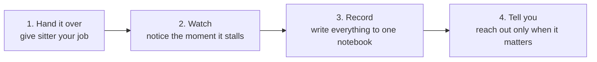

# sitter

<div align="center">

**🇺🇸 English** ｜ [🇯🇵 日本語](README.ja.md) ｜ [🇨🇳 简体中文](README.zh.md) ｜ [🇹🇭 ไทย](README.th.md)


<h4>A free tool that watches over the long-running work you hand to an AI or to your computer.</h4>

[](https://github.com/caty-ai/sitter/actions/workflows/ci.yml)
[](LICENSE)
[](https://www.npmjs.com/package/@caty-ai/sitter)

-lightgrey)


[What it does](#what) ｜ [What you need](#requirements) ｜ [Get started](#start) ｜ [Why it's safe](#safety) ｜ [Learn more](#more)

It checks whether the work really finished, whether it quietly stopped halfway,<br>
and whether a reply you are waiting for has been forgotten — and it always tells you.

**No more work that disappears without a word.**

🔧 [Engineering documentation](docs/engineering.md) ｜ 📘 [Full reference](docs/reference.md)

</div>

---

<div align="center">


</div>

---

## Does any of this sound familiar?

If even one of these rings true, sitter is for you.

- The work you asked an AI to do had stopped, and you only noticed hours later
- You sent a question, no answer came, and you forgot you were even waiting
- An overnight job looked fine, but by morning it had not moved an inch
- So many things are running that you cannot tell which ones are still alive

The cause is always the same: **nobody is watching**.
sitter takes that job over completely.

One thing to know up front: sitter watches **work you run in a terminal**. If you only use the ChatGPT or Claude apps, it is not for you.

---

<a id="what"></a>

## What sitter does for you

Four things, in this order.



- 👀 **Watch**

  It stays with the job and keeps checking whether it finished or froze along the way.

- 📝 **Record**

  Everything that happens — started, failed, succeeded — goes into one notebook. It is a plain text file, so you can always go back and see what happened.

- 🔔 **Tell you**

  When something happens that a human should know about, it reaches you the way you chose. By default it appends a line to a memo file; if you would rather get a Slack message or a desktop alert, you say so.

- ⏰ **Chase replies**

  It stops you from asking someone a question and then forgetting about it. Once the deadline passes it reminds you automatically, and in the end it says "this needs a human now".

---

<a id="requirements"></a>

## What you need

Nothing new to buy. Just these three things.

- **A computer**

  Mac, Linux, or Windows (WSL). Your everyday machine is fine.

- **Work you run from a terminal**

  sitter watches jobs you start from a terminal. AI agents such as Claude Code and Codex CLI, tests, builds, data processing — **anything you can launch with a command** qualifies. If you only use the ChatGPT or Claude apps, it is not for you.

- **Dependencies and costs**

  None. No extra software to install, no account to create. (What you pay for the tool being watched — Claude Code, say — is separate.)

For the full table, see [supported environments](docs/engineering.md#compatibility).

---

<a id="start"></a>

## Get started

There are two ways in. If you use an **AI agent that runs in your terminal** (Claude Code, Codex CLI, and the like), asking it is by far the fastest.

> **Note:** Claude Code here means the developer tool that runs in a terminal, not the Claude app. If you only have the app, skip to "Install it yourself" below.

### Let your AI install it

Hand your AI agent the URL of this page and ask:

```text
https://github.com/caty-ai/sitter
Install this tool and show me how to use it
```

sitter is a small, single-file tool, so most agents will take it all the way through installation. If that does not work, run the steps below yourself.

### Install it yourself

Three steps. Open a terminal first — on a Mac it is in Applications → Utilities → Terminal. On Windows, read [Windows support](docs/engineering.md#windows-support) first. Copy each command, paste it, press Enter.

Inside sitter there is exactly one readable text script. It never asks for your admin password and never changes your system settings.

**The short way (if you have Node.js)**

```sh
npm install -g @caty-ai/sitter
```

If that finishes without an error, skip straight to step 2. It installs the same single script, and `npm update -g @caty-ai/sitter` keeps it up to date. No `npm`? Use the three steps below.

**1. Download it**

```sh
mkdir -p ~/.local/bin
curl -fsSL https://raw.githubusercontent.com/caty-ai/sitter/main/sitter -o ~/.local/bin/sitter
chmod +x ~/.local/bin/sitter
export PATH="$HOME/.local/bin:$PATH"
echo 'export PATH="$HOME/.local/bin:$PATH"' >> ~/.zshrc
```

The last two lines let you call the tool by typing `sitter` (the first for the terminal you have open, the second for every terminal after that). On Linux without `zsh`, read `~/.zshrc` as `~/.bashrc`.

**2. Check that it works**

```sh
sitter run --ledger /tmp/sitter-test.jsonl --on-fail 'cat >&2' -- sh -c 'sleep 3; echo test'
grep -o '"status":"success"' /tmp/sitter-test.jsonl
```

Wait about three seconds; if `"status":"success"` appears, you are installed. It means "the job was watched, and its completion was recorded".

One thing that surprises people: sitter captures the watched job's screen output into `~/.sitter/logs/` instead of your terminal. Silence is normal. To read it, list the files with `ls ~/.sitter/logs/` and open one with `cat ~/.sitter/logs/<filename>`.

**3. Have it watch your own work**

```sh
sitter run --ledger ~/.sitter/runs.jsonl --on-fail 'cat >> ~/sitter-alerts.txt' -- sh -c 'sleep 30; echo done'
```

Replace everything after `--` with **the command you normally type**. Whenever that work fails or freezes, a note is appended to `~/sitter-alerts.txt`. The record of what happened stays in `~/.sitter/runs.jsonl`. (Both are machine-readable formats, so each line looks like one long string.)

This example only **writes to files** — nothing pops up on screen. To get a desktop notification or a Slack message instead, you change what `--on-fail` runs. If you are not sure how, ask your AI agent for "a sitter notification that shows up in the macOS notification centre".

**Know what counts as "frozen"**

sitter treats a job as frozen when it produces **no output at all — screen or log — for 15 minutes**, and it stops the job (with a hard limit of four hours). If you are watching work that stays silent until it finishes, tell sitter to use the time limit only.

```sh
sitter run --ledger ~/.sitter/runs.jsonl --on-fail 'cat >> ~/sitter-alerts.txt' --stall-after 0 --timeout 3600 -- sh -c 'sleep 30; echo done'
```

<details>
<summary>If something goes wrong</summary>

<br>

**It says `sitter: command not found`**

The last two lines of step 1 may not have taken effect. Run this one line, then try again.

```sh
export PATH="$HOME/.local/bin:$PATH"
```

If it still happens, close the terminal and open it again.

**The download says `404`**

Right after a release it can take a moment to propagate. Wait a little and run it again.

</details>

---

<a id="safety"></a>

## Why it is safe to use

"Never act on its own" is the pillar sitter is designed around.

- **It never retries on its own**

  A failed job is retried only when you have explicitly declared it safe to retry. Everything else is reported, not repeated.

- **There is a guard against slips**

  Commands that publish or cost money — `git push`, `npm publish`, `kubectl delete` and the like — are refused before they are ever watched. Be clear about what this is, though: it is **a simple guard against accidents**, not a wall against every dangerous operation (`rm`, for instance, is not covered).

- **Everything is written down**

  Whatever happened, you can trace it in the notebook whenever you want.

- **One line stops all of it**

  This single line stops the watching and any retries.

  ```sh
  touch ~/.sitter/STOP
  ```

---

<a id="more"></a>

## Learn more

Entry points by purpose.

| What you want | Where to look |
| --- | --- |
| How it works, the commands, the design (for engineers) | [docs/engineering.md](docs/engineering.md) |
| The exact contract (every flag, every internal rule) | [docs/reference.md](docs/reference.md) |
| How the design came about | [docs/design-history.md](docs/design-history.md) |
| I want to contribute | [CONTRIBUTING.md](CONTRIBUTING.md) |
| I found a bug or a vulnerability | [SECURITY.md](SECURITY.md) |

<!-- family:generated:family-footer:start -->

---

Part of the **Caty AI family** — open tools for running a family of AI agents. The full map, including modules still being prepared for release, lives in [Family OS](https://github.com/caty-ai/family-os).

| Axis | Module | What it does | State |
| --- | --- | --- | --- |
| Map | [Family OS](https://github.com/caty-ai/family-os) | The map of the whole family — every module, its state, and how they fit | published, MIT |
| Rules | [Family Dev Handbook](https://github.com/caty-ai/family-dev-handbook) | The rules of the road — issues, PRs, worktrees, handoffs, parallel development | published, MIT |
| Vertical · foundation | [Caty Agent Harness](https://github.com/caty-ai/caty-agent-harness) | Task backbone for AI agents — retries, checkpoints, and honest completion | published, MIT |
| Vertical | [context-kit](https://github.com/caty-ai/context-kit) | Six-piece context hygiene kit for one agent — bounded output, delegation briefs, safety guards, recall, worktree snapshots | published, MIT |
| Vertical | [Persona Engine](https://github.com/caty-ai/persona-engine) | Gives an agent a persona — layered personality and graded emotion | published, MIT |
| Vertical | [Persona Growth Loop](https://github.com/caty-ai/persona-growth-loop) | Grows the persona itself — minimal, idempotent proposals | published, MIT |
| Vertical | [X Collector](https://github.com/caty-ai/x-collector) | Turns X and the web into one daily digest — for people and agents | published, MIT |
| Vertical | [Self Growth Loop](https://github.com/caty-ai/self-growth-loop) | Lets an agent grow its own abilities — proposals, governance, adoption records | published, MIT |
| Horizontal · foundation | [Family Memory Architecture](https://github.com/caty-ai/family-memory-architecture) | The memory bus — how the family shares what it knows | published, MIT |
| Horizontal | **Sitter** | Babysits delegated agent runs — watches, keeps evidence, restarts only within declared bounds | published, MIT |
| Horizontal | [Alpha Nightshift](https://github.com/caty-ai/alpha-nightshift) | Nightly autonomous maintenance loop — isolated night lanes behind a deny-by-default guard; humans cherry-pick in the morning | published, MIT |

<!-- family:generated:family-footer:end -->

---

## Project status

[](https://github.com/caty-ai/sitter/actions/workflows/ci.yml)

- **CI** — the badge above is live: every push to main and every pull request runs the full fault-injection suite (the case count is machine-reported by `make test`)
- **Verified environments** — Ubuntu gates every pull request; macOS runs on every push to main; Windows (Git Bash) is a best-effort lane
- **Maturity** — v0.3.0; the four v0 verbs (`run` / `expect` / `ack` / `sweep`) are spec-frozen in docs/requirements-v0.md, and `ask` / `watch` are pinned by docs/specs/prd-v0.2-ask-watch.md (audited in v0.2.0)
- **Known limitations** — the denylist is an accident guard, not a security wall; retries happen only for jobs you explicitly declared idempotent

---

## License

[MIT](LICENSE) © 2026 Caty

We want anyone to use it, change it, and build it into their own tools and services, so it is MIT. Keep the copyright notice and nothing else is restricted — commercial use included, modified copies included.

---

<div align="center">

**One bash file** ｜ **Any CLI agent** ｜ **Zero dependencies, free**

</div>
