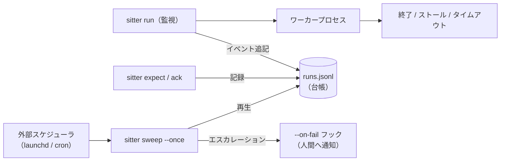

# sitter — エンジニア向けドキュメント

[← やさしい入口（トップ README）](../README.ja.md) | [詳細リファレンス](reference.ja.md)

[](https://github.com/caty-ai/sitter/actions/workflows/ci.yml)
[](../LICENSE)

-lightgrey)


長時間コマンドの「ベビーシッター」です。AI コーディングエージェント・バッチ処理・
任意の CLI ワーカーを sitter に預けると、そのジョブは必ず
**完走するか、安全に再起動されるか、人間に報告されるか**のどれかになります。
黙って消えることは決してありません。

---

## なぜ必要？

**こんなことはありませんか？**

- Claude Code から別のエージェント CLI を起動したものの、
  呼び出し側がタイムアウトして観測を失い、数時間後に停止やハングが見つかる。
- 別のエージェントセッションを起動したり、質問や催促（nudge）を送ったりしたのに、
  返事が来ないまま、その返事待ち自体を忘れてしまう。
- 夜通し動かしたテスト・ビルド・データ処理が生きたまま残っているが、
  ログは止まり、実際には何も進んでいない。
- 複数のエージェントや長時間ジョブが端末ごとに散らばり、どれかが止まったり
  返事待ちになったりしても、追い切れずに見落としてしまう。

共通する原因は、任せた仕事が動いているのか、止まっているのか、返事を待っているのかを、
誰も見張っていないことです。

sitter は、私たちが複数の AI エージェントと実際に働くなかで、
こうした事故を何度も経験したことから生まれました。
任せた仕事を外側から見守り、完了を確認します。止まったときに再起動するのは、
安全条件を満たす仕事だけです。条件を満たさない場合や、再起動しても戻らない場合は、
人間に報告します。対象の実行環境（runtime）全体を支配したり、
仕事の進め方を決めたりはしません。

事故をまとめると、次の 3 つです:

- **無言死** — プロセスが止まっているのに、誰も気づかない。
- **無限ハング** — プロセスは生きているが、ログが増えなくなっている。
- **返事の放置** — 返事が来ないまま、返事待ちであること自体が忘れられている。

sitter は、依存ゼロの小さな bash ツール 1 つでこの 3 つを塞ぎます。
任せた仕事を起動して見張り、起きたことをすべて 1 つのテキストファイルに
記録し、人間が知るべきことが起きたら、あなたが選んだ通知コマンドを 1 つ
実行します（Slack への送信でも、ファイルへの追記でも、何でも構いません）。

---

## 対応環境

依存はゼロ（bash 3.2+ と標準 userland のみ）。追加インストール・追加費用は
ありません。

### OS

| 環境 | 対応状況 | 補足 |
| --- | --- | --- |
| macOS | ✅ 対応 | bash 3.2+。macOS で全テストを実行して監査済み |
| Linux | ✅ 対応 | bash 3.2+。Ubuntu 24.04 で全テストを実行して監査済み |
| Windows（WSL） | ✅ 対応 | WSL 内で Linux 版を実行し、Sitter のファイルは Linux 側に置く |
| Git Bash / MSYS2 | ⚠️ 実験的 | 動作はするが、権限とタイミングの意味論差で数件が失敗する。Windowsの正式な利用経路はWSL。詳細は[Windows対応](#windows-対応) |

### AIエージェント / CLIワーカー

Sitter は特定のエージェントに依存しません。ここでの「対応」は、CLIまたは
ラッパーから有限のジョブとして起動できるという意味です。Sitter がその
エージェントのruntimeを所有・設定するという意味ではありません。

| 対象 | 対応状況 | 接続方法 |
| --- | --- | --- |
| Claude Code | ✅ 対応 | CLIコマンドを `sitter run` で実行。返事待ちは `expect` / `ack` または `ask` / `watch` で追跡 |
| Codex CLI | ✅ 対応 | 同じCLI / ラッパー契約で利用でき、Codex専用adapterは不要 |
| OpenClaw | ✅ CLI / ラッパー経由で対応 | 有限のOpenClawジョブを見守る。OpenClawサービスやruntime全体は管理しない |
| Hermes | ✅ CLI / ラッパー経由で対応 | 有限のHermesジョブを見守る。Hermesサービスやruntime全体は管理しない |
| その他のCLIエージェント / バッチ処理 | ✅ 対応 | 同じプロセス境界・ログ境界を持つ通常のコマンド |

認証・セッション・モデルproviderの設定・ワーカー固有の健康判定は、対象ワーカー
またはラッパー側の責務です。Sitter が見るのは、明示的に渡されたコマンド・ログ・
返事の記録だけです。

---

## 60 秒でわかる仕組み

sitter は「頼んだ仕事がちゃんと終わったかを、代わりに見張ってくれる係」です。むずかしい設定はなく、やることは次の 6 つの約束だけ。1 つずつ読めば全体がわかります。

1. **`sitter run -- <コマンド>`** がコマンドを起動して見張ります。
   ログが伸びなくなったら（`--stall-after`・既定 15 分）、または絶対時間上限
   （`--timeout`）を超えたら「詰まった」と判定し、kill して失敗として記録します。
2. **台帳（`runs.jsonl`）** はただの追記専用テキストファイルで、1 行 = 1 JSON
   イベント（開始・ストール・再起動・失敗・成功）。ダッシュボードやスクリプトは
   このファイルを読むだけで連携でき、他の仕掛けは一切不要です。
3. **`--on-fail` フック**は自由に選べる 1 つのコマンド（Slack 送信・inbox
   ファイルへの追記など何でも）。人間が知るべきことが起きるたびに sitter が
   呼び出します。必須フラグなので、「通知が設定されていなかった」という事故は
   構造的に起こりません。
4. **再起動はオプトイン + 二重の柵。** 失敗したジョブは既定では再起動されず、
   報告だけされます。再起動されるのは「冪等」と明示宣言され *かつ*
   allowlist にバイト完全一致で載っているコマンドだけで、回数上限と
   クールダウン付き。危険コマンド（`git push`・デプロイ・課金系…）は
   起動前に拒否されます。
5. **`expect` / `ack` / `sweep`** は「返事のデッドマン装置」です。`expect` が
   「返事を待っている」ことを記録し、`ack` が「返事が来た」ことを記録し、
   定期実行の `sweep` が期限切れを 2 回催促 → 最後は人間へエスカレーション。
   借りっぱなしの返事は絶対に忘れられません。
6. **`ask` / `watch`** は送信と返事の境界を永続化します。`ask` は expectation
   id ごとに sender 1 件を原子的に予約し、`watch` は reply-file の変化を検出して
   acknowledgement を記録します。同じ id の並行 ask が両方 sender を実行する
   ことはありません。

---

<a id="demos"></a>

## デモ録画

README には成功→凍結検知の合体デモを載せています。パターン別の録画 3 本は [assets/demos/](../assets/demos/) にあります。

- **[demo-stall.gif](../assets/demos/demo-stall.gif)** — 凍結検知。結果確認は `jq`
- **[demo-nodeps.gif](../assets/demos/demo-nodeps.gif)** — 同じ凍結検知を `cat` と `grep` だけで確認（追加ツールなし）
- **[demo-success.gif](../assets/demos/demo-success.gif)** — 普通に完走するジョブ。アラートは出ず、台帳に成功が残る
- **[demo-ask.gif](../assets/demos/demo-ask.gif)** — 返事トラッキング。alpha が cero に質問し、SLA 切れを sweep が自動催促、返事が届いた瞬間に `watch` が自動でクローズする（alpha と cero は caty-ai ファミリーの AI エージェント本人たちです）

すべての録画は同ディレクトリの [vhs](https://github.com/charmbracelet/vhs) tape から生成しており、挙動が変わったらリポジトリ直下で `vhs assets/demos/<name>.tape` を実行すれば決定論的に撮り直せます。デモが 30 秒前後に収まるよう tape 側で `SITTER_POLL_INTERVAL` と `--grace` を短縮しています（本番の既定値は stall 15 分 / grace 10 秒）。

---

## クイックスタート

単一ファイルの bash スクリプトなので、PATH に置くだけで導入は完了します。

前提: macOS または Linux の bash 3.2+。それ以外の依存はありません。
Windows では [WSL](https://learn.microsoft.com/ja-jp/windows/wsl/) を
使ってください — [Windows 対応](#windows-対応)を参照。

**インストール**

Node.js がある環境なら、PATH と更新を npm に任せられます:

```sh
npm install -g @caty-ai/sitter
```

npm がない場合は、スクリプトを直接 PATH に置きます:

```sh
mkdir -p ~/.local/bin
curl -fsSL https://raw.githubusercontent.com/caty-ai/sitter/main/sitter -o ~/.local/bin/sitter
chmod +x ~/.local/bin/sitter
command -v sitter
```

リポジトリを clone して `install -m 0755 sitter ~/.local/bin/sitter` でも同じです。
`command not found` になる場合は `~/.local/bin` を PATH に追加してください。

> **メモ:** `sitter --help` は usage を stdout に出して exit 0 で終了し、
> `sitter --version` はリリースを表示します。どちらもインストール確認に使えます。

**動作確認**

```sh
sitter run --ledger /tmp/demo.jsonl --on-fail 'cat >&2' -- sh -c 'echo hello from worker'
cat /tmp/demo.jsonl
```

最後のコマンドで JSON が 2 行表示されます — `start` イベントと、
`"status":"success"` の `end` イベントです。ワーカーの出力は
`~/.sitter/logs/` 配下のログに保存されています。

次に、ハングを捕まえる様子を見てみましょう。このジョブは 60 秒眠ろうとしますが、
5 秒の上限で kill されます:

```sh
sitter run --ledger /tmp/demo.jsonl --on-fail 'cat >&2' --stall-after 0 --timeout 5 -- sleep 60
```

約 5 秒後にジョブは kill され、台帳に `stall` → `fail` → `end`（status
`failed`）が追記され、`--on-fail` のコマンドが失敗ペイロードを受け取ります
（この例では stderr に表示）。これが全ループです: 何も無言で消えず、
すべて記録され、人間に通知されます。

既存のダッシュボードに流し込むには、その JSONL ファイルを `--ledger` に
指定するだけです — sitter の行は素朴な
`{ts, event, status, project, agent, task}` 台帳の厳格上位集合です。

---

## 特徴

一番大事な特徴は「失敗を絶対に黙って見過ごさない」こと。下のリストは、それを仕組みでどう保証しているかの一覧です（読み飛ばして、必要になったら戻ってきても大丈夫です）。

- **決定論的な生死判定** — 終了コード + ログ mtime ストール（既定 900 秒）+
  絶対時間上限。LLM 判定なし・ワーカー固有プローブなし
  （[ADR-0001](adr/0001-no-probe-flag.md)）。
- **構造で保証された再起動安全性** — 再起動は「冪等宣言 + allowlist
  バイト完全一致」の二重ゲートを通ったコマンドのみ。ハードコードされた
  denylist が push/デプロイ/公開/課金系を spawn 前に拒否。リトライ予算と
  クールダウンは呼び出しをまたいで持続します。ただしこれは best-effort の
  事故防止ガードであって、セキュリティ境界ではありません: `env`・`nice`・
  `nohup`・`timeout`・`stdbuf`・`caffeinate` のランチャ接頭辞は剥がし、
  `sh -c`/`bash -c`/`zsh -c`/`dash -c` の文字列は部分一致で検査しますが、
  コピー・改名されたバイナリや特殊なラッパーは対象外です。
- **絶対に無言で失敗しない** — `--on-fail` は必須。terminal 失敗・拒否・
  各エスカレーション段階のすべてが 1 つのフック経由で人間に届きます。
- **返事のデッドマン装置** — `expect` で登録、`ack` で解除、外部スケジュール
  の `sweep` が催促 2 回 → `awaiting_human` へエスカレーション。
- **原子的な ask/watch 回復** — `ask` は外部処理中に台帳 lock を保持せず、
  expectation generation ごとに sender の勝者を 1 件だけにします。`watch` は
  reply-file の変化を acknowledgement し、`--already-sent` は再送せず元の
  baseline から再開します。
- **依存ゼロ・契約は 1 つ** — bash + JSONL。連携点は台帳パスと
  `--on-fail <cmd>` フックの 2 つだけ。ダッシュボードや通知系はそこに
  接続し、sitter は相手を一切知りません。
- **キルスイッチ 1 つ** — ファイル 1 個で監視・再起動・sweep のすべてが
  停止します。

---

## アーキテクチャ

sitter の登場人物は 3 つだけです — ①本体（bash スクリプト 1 ファイル）②台帳（ただのテキストファイル）③通知フック（あなたが選んだコマンド 1 つ）。この小ささが売りです。

設計原則（bootstrap 時に凍結）:

- **責務分離**: `sitter run` = 有界再起動の監督 / `sitter expect`・`ack` =
  返事状態の記録 / `sitter ask`・`watch` = 送信境界と reply-file の観測 /
  `sitter sweep --once` = 外部スケジュール駆動のエスカレーションパス。
- **決定論優先**: 監視パスに LLM 判定を入れない。
- **liveness より安全**: リトライ上限とクールダウンは必須、再起動には
  冪等の明示宣言が必要、terminal 失敗は必ず人間へ通知。
- **依存ゼロ・契約 1 つ**: bash + JSONL、連携点は 2 つ。



| 部品 | 役割 |
| --- | --- |
| `sitter` | 単一ファイルの bash CLI: `run`・`expect`・`ack`・`ask`・`watch`・`sweep` |
| `runs.jsonl` | 追記専用イベント台帳（legacy `sitter.v0` 行 + ask/watch の `sitter.v1` 行） |
| `--on-fail <cmd>` | 唯一の通知フック。`SITTER_*` 環境変数 + stdin の JSON 1 行を受け取る |
| `examples/` | フック・LaunchAgent・ワーカーラッパーの各テンプレート |
| `tests/` | 依存ゼロの故障注入テストスイート（偽ワーカー + 縮小タイマー） |

ワーカー固有の健康知識（API ping・部分出力の判定など）は意図的に sitter の
**外**、そのワーカーを所有するラッパー側に置きます —
[ADR-0001](adr/0001-no-probe-flag.md) と
[`examples/probe-wrapper.sh`](../examples/probe-wrapper.sh) を参照。

---

## 使い方

覚える形は 1 つだけ — 「`sitter run` + 台帳の場所 + 通知コマンド + 見張りたいコマンド」です。

```sh
sitter run --ledger <台帳ファイル> --on-fail <通知コマンド> -- <見張りたいコマンド>
```

これに「何分待ったら詰まり扱いにするか」などのオプションを足していきます。
よく使う組み合わせは 2 つだけ覚えれば十分です:

- ログを書き続けるワーカー: `--stall-after 900 --timeout 3600`
  （15 分ログが止まったら失敗扱い・最長 1 時間）
- 完了まで何も出力しないワーカー: `--stall-after 0 --timeout 1500`
  （ログ判定を切って、25 分の絶対上限だけで区切る）。必要なら
  ヘルスプローブ付きラッパー
  （[`examples/probe-wrapper.sh`](../examples/probe-wrapper.sh)）を挟む

`run` のほかに、返事待ちを管理する `expect` / `ack` / `ask` / `watch` /
`sweep` という動詞があります（次の 2 セクションで説明）。全コマンドの
フラグ一覧は[詳細リファレンス](reference.ja.md#cli-全コマンドとフラグ)へ。

---

## 返事トラッキング（expect / ack / sweep）

「あの人に質問を投げたけど、返事来たっけ？」を代わりに覚えておいて、期限を過ぎたら催促までしてくれる機能です。  例えるなら: 後輩に資料作成を頼む → 締切を過ぎても届かなければ 2 回リマインド → それでも届かなければ「そろそろ人間の出番です」と上司に知らせる — この流れを全部自動でやるイメージです。

使い方は 3 つの動詞に対応します:

- `expect` = 「X に質問した。期限（SLA）以内に返事が来るはず」とメモする
- `ack` = 「返事が来た」とメモして消し込む
- `sweep` = launchd や cron で数分おきに走り、未解決の返事待ちを総ざらいして
  期限切れに催促（あなたの `--on-fail` 通知経由）→ 2 回目の催促 → 最後は
  「人間判断待ち（`awaiting_human`）」としてエスカレーション

借りっぱなしの返事が忘れられることは、仕組み上ありません。
ID の規則・催促がちょうど 1 回ずつ飛ぶ保証などの正確な仕様は
[詳細リファレンス](reference.ja.md#返事トラッキングの詳細)へ。

---

## ask / watch

「質問を送る」と「返事が来たら自動で気づいて消し込む」をセットで自動化する機能です。送りっぱなしで忘れる事故を防ぎます。  例えるなら: ポストに手紙を出した瞬間に「返事待ちリスト」へ自動で載り、返事の封筒が届いた瞬間にリストから自動で消える — そんなイメージです。

使い方は 2 つの動詞です:

- `ask` = 送信コマンドの実行と「返事待ちの登録」をワンセットで行う。
  返事が書き込まれる先のファイル（reply-file）をあらかじめ決めておきます
- `watch` = reply-file が変化したかを確認し、返事が来ていたら自動で
  消し込み（`ack`）を記録する

途中でクラッシュしても「送ったのに追跡されていない」状態から安全に復帰
できます（`ask --already-sent`）。同じ id で同時に 2 つ送ろうとしても、
実際に送信できるのは必ず 1 つだけです。障害時の正確な挙動・id の再利用
ルールなどは[詳細リファレンス](reference.ja.md#ask--watch-の詳細契約)へ。

例:

```sh
tmpdir=$(mktemp -d)
ledger="$tmpdir/runs.jsonl"
reply="$tmpdir/reply.txt"
sitter ask --ledger "$ledger" --to reviewer --sla 0 --reply-file "$reply" -- \
  sh -c 'printf "reply\n" > "$1"' sh "$reply"
sitter watch --once --ledger "$ledger"
# stdout: acked <expect_id>
```

同梱の [LaunchAgent example](../examples/ai.caty.sitter.sweep.plist) を使うには、
プレースホルダのパスを書き換えてから `~/Library/LaunchAgents` へコピーし、
ロードします:

```sh
cp examples/ai.caty.sitter.sweep.plist ~/Library/LaunchAgents/
launchctl bootstrap "gui/$(id -u)" ~/Library/LaunchAgents/ai.caty.sitter.sweep.plist
```

cron での等価な 1 行はこちらです:

```cron
*/5 * * * * /path/to/sitter sweep --once --ledger /path/to/runs.jsonl --on-fail /path/to/hook.sh
```

sweep は重複起動しても安全（ロックで守られ、後から来た方は何もせず終了）で、
キルスイッチファイルがあれば催促せず即終了します。壊れた行や失敗し続ける
通知は 3 回で隔離（quarantine）されます。運用面の正確な仕様は
[詳細リファレンス](reference.ja.md#sweep-の運用詳細)へ。

---

## 通知フック（--on-fail）

「人間が知るべきことが起きたら、このコマンドを実行して」という指定です。Slack への送信でも、ファイルへの 1 行追記でも、好きなコマンドを渡せます。

発火するのは「人間が動くべき時」だけです — ①危険コマンドを拒否した時
②run が terminal に失敗した時 ③リトライ予算を使い切った時
④返事の催促（2 回まで）⑤「人間の出番です」のエスカレーション。成功した run・
再起動前の試行ごとの `fail` イベント・キルスイッチでは発火しません。
イベントの詳しい中身
（環境変数・JSON ペイロード）と書き方の注意は
[詳細リファレンス](reference.ja.md#フックの発火理由とペイロード)へ。
極小のアダプタ例は
[drop-file フック example](../examples/on-fail-dropfile.sh) にあります。

---

## Windows 対応

Windows では [WSL](https://learn.microsoft.com/ja-jp/windows/wsl/) （Windows の中で Linux を動かす公式機能）を使えば、Linux 版がそのまま動きます。

**サポート対象: WSL（WSL 2 推奨）。** WSL の中では sitter は CI が常時
グリーンに保っている Linux ビルドそのものです — Linux と同じように
インストール・使用してください。台帳と `$SITTER_HOME` は `/mnt/c` 配下では
なく Linux ファイルシステム側（`~` など）に置くこと。ファイルロックと
mtime の意味論が POSIX のまま保たれます。

sweep のスケジュールは WSL 内の cron（上記の cron 行。最近の WSL では
`sudo service cron start` か systemd unit で cron を一度有効化）、または
Windows のタスクスケジューラから駆動できます:

```
schtasks /Create /SC MINUTE /MO 5 /TN sitter-sweep ^
  /TR "wsl.exe -e /home/<you>/.local/bin/sitter sweep --once --ledger /home/<you>/.sitter/runs.jsonl --on-fail /home/<you>/hook.sh"
```

**実験的サポート: Git Bash / MSYS2。** 動作はして大半のテストも通りますが、
3 件が失敗します。CI で Git Bash を非ブロッキングジョブに留め、WSL を正式な
利用経路としているのはこのためです。3 件のうち 2 件は `chmod` で権限を落とした
あとに操作が拒否されることを確認するもの（読めない reply-file・書けない台帳
ディレクトリ）で、Git Bash はこの拒否を強制しないため、POSIX なら失敗する操作が
成功してしまいます。残る 1 件は `TERM` を trap するフックを kill する際の
シグナルタイミングです。Git Bash はスイート実行も約 3 倍遅く、タイミング依存の
ケースが不安定になります。WSL では起きません。対応に至った調査の経緯は
[詳細リファレンス](reference.ja.md#git-bash--msys2-対応の経緯)へ。

Windows ネイティブのシェル（PowerShell / CMD）は sitter が必要とする
bash / POSIX 環境を提供しないため、WSL（または実験的に Git Bash）経由で
実行してください。

---

## 設定

優先順位は常に「フラグ > 環境変数 > 既定値」。設計上、設定ファイルは
ありません。

| やりたいこと | 見る場所 |
| --- | --- |
| 全コマンドとフラグの一覧を見る | [docs/reference.ja.md](reference.ja.md#cli-全コマンドとフラグ) |
| stall/timeout/retries を run 単位で調整 | `sitter run` フラグ。env fallback は `SITTER_STALL_AFTER`・`SITTER_TIMEOUT`・`SITTER_RETRIES`・`SITTER_COOLDOWN` |
| 状態の置き場所を変える（ログ・ロック・キルスイッチ） | `SITTER_HOME`（既定 `~/.sitter`・mode 0700） |
| 今すぐ全部止める | `touch $SITTER_HOME/STOP`（または `--kill-file` / `SITTER_KILL_FILE` のパス） |
| あるコマンドの再起動を許可する | `--idempotent NAME --allowlist <file>`。allowlist は 1 行 = コマンド全文・バイト完全一致 |
| 通知フックの発火条件と受け取り方を知る | [docs/reference.ja.md](reference.ja.md#フックの発火理由とペイロード) |
| 台帳の全フィールドを理解する | [docs/requirements-v0.md](requirements-v0.md) 項目 1 |

---

## ドキュメント

| ドキュメント | 内容 |
| --- | --- |
| [docs/reference.ja.md](reference.ja.md) | 詳細リファレンス（全フラグ・返事トラッキング/ask・watch の正確な仕様・フックのペイロード） |
| [docs/requirements-v0.md](requirements-v0.md) | 凍結済み v0 要件。項目ごとの裁定と理由付き |
| [docs/design-history.md](design-history.md) | 各設計ラウンドの進め方と決定事項（v0・Phase 2・Windows 監査・v0.2 ask/watch） |
| [docs/adr/0001-no-probe-flag.md](adr/0001-no-probe-flag.md) | `--probe` フラグが存在しない理由と、サポートされるラッパー層の逃げ道 |
| [docs/adr/0002-expect-single-writer.md](adr/0002-expect-single-writer.md) | 共有ディレクトリ expect 投入: v0 非契約の宣言と、将来の第 2 writer に向けた形式監査 |
| [docs/specs/prd-v0.2-ask-watch.md](specs/prd-v0.2-ask-watch.md) | 承認済み v0.2 ask/watch 設計（PRD・英語） |
| [docs/specs/test-spec-v0.2-ask-watch.md](specs/test-spec-v0.2-ask-watch.md) | 凍結済み v0.2 ask/watch テスト仕様（英語） |

---

## ステータス

**v0.2.1 — 監査済みリリース候補。** 凍結済みの v0 監視・返事デッドマン契約に
`ask` / `watch` の reply-file 境界が加わりました。同一 id の admission は原子的で、
並行する `ask` のうち外部 sender を実行できるのは 1 件だけです。敗者は sender を
実行する前に終了します。仕様は引き続き `docs/requirements-v0.md` に凍結されており、
挙動変更には新しい要件ラウンドが必要です。v0.2.1 では stdout・exit 0 の
`--help` / `-h` / `--version` が加わり、凍結済みの監視契約は変わりません。
据え置き項目と再訪トリガーは
[docs/design-history.md](design-history.md)
に記録されています:

- [x] `run` 監視: stall/timeout kill・有界の冪等再起動・denylist 拒否
- [x] `expect`/`ack`/`sweep` 返事デッドマン（催促 2 回 → `awaiting_human`。各遷移は正確に 1 回発火）
- [x] `ask`/`watch`: exact argv の sender 実行・永続的な reply-file baseline・再送しない回復・同一 id の原子的 admission
- [x] 正準の故障注入スイート — ケース数はスイート自身が機械出力する（`bash tests/run.sh` の summary 行: 149 PASS, 0 FAIL, 81 ask/watch cases。[この実行](https://github.com/caty-ai/sitter/actions/runs/32236745818)時点）。macOS と Ubuntu 24.04（非 root・repository read-only）で監査済み
- [ ] 実行後の曖昧ケース分類（exit 0 なのに空振りの検出）— まず受動計測から。sitter コアの外に置く
- [ ] 共有ディレクトリ expect 投入 — 具体的な利用者が現れるまで据え置き（[ADR-0002](adr/0002-expect-single-writer.md)）

---

## テスト

正準の依存ゼロスイートは `bash tests/run.sh` でローカル実行できます
（旧 `bash scripts/dev-smoke.sh` はこれに委譲します）。各シナリオは隔離された
一時サンドボックスで走り、失敗時はアーティファクトのパスが表示されます。
CI は全 pull request で同じスイートを Ubuntu 上で実行し、`main` への push では
さらに macOS と、非ブロッキングの Windows Git Bash ジョブを追加します。
カバー範囲は監視・再起動安全性・
返事エスカレーション/再生・ask の原子的 admission・ロック競合・不正台帳
quarantine・ポータブル JSONL 挙動です。
Python 3 があれば JSON 構文チェックも追加されます。

---

## コントリビュート

[CONTRIBUTING.md](../CONTRIBUTING.md) を参照してください。Issue ファースト・
小さな PR・そして v0 凍結が適用されます: 挙動変更はコードの前に
要件ラウンドの議論が必要です。

---

## ライセンス

[MIT](../LICENSE) © 2026 Caty
