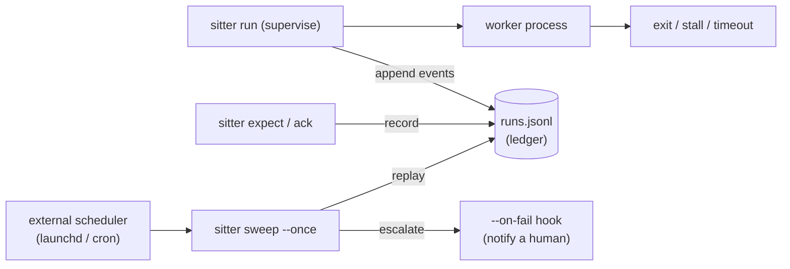

# sitter — engineering documentation

[← Plain-language landing page (top README)](../README.md) | [Full reference](reference.md)

[](https://github.com/caty-ai/sitter/actions/workflows/ci.yml)
[](../LICENSE)

-lightgrey)


A babysitter for long-running commands. You hand sitter a command — an AI
coding agent, a batch job, any CLI worker — and it makes sure the job either
**finishes, gets safely restarted, or a human hears about it**. Nothing ever
just silently disappears.

---

## Why?

Does any of this sound familiar?

- You launched another agent CLI from Claude Code, the caller timed out
  and lost sight of it, and the stall was only discovered hours later.
- You sent a question or a nudge to another agent session, the reply never
  came — and the fact that a reply was still owed was itself forgotten.
- An overnight test, build, or data job looked alive the whole time, but
  its log had stopped and nothing was actually moving.
- Agents and long jobs were spread across terminals, and when one of them
  stopped or sat waiting for an answer, nobody could keep track.

The common cause: nobody is watching whether delegated work is running,
stuck, or waiting on a reply.

sitter was born from hitting these accidents over and over while actually
working with multiple AI agents. It watches delegated work from the
outside and confirms completion. It restarts a job only when explicit
safety conditions are met; otherwise — or when restarting doesn't help —
it reports to a human. It never takes over the target runtime — the
environment the job runs in — or decides how the work should be done.

In short, three failure modes:

- **Silent death** — the process dies and nobody notices until hours later.
- **Endless hang** — the process is technically alive but has produced
  nothing for an hour, and would happily sit there all night.
- **Forgotten replies** — a job asked someone a question, the answer never
  came, and no one was tracking that it was still owed.

sitter closes all three with one small, dependency-free bash tool: it
starts your job and watches it, writes down everything that happens in one
plain text file, and — whenever a human should know — runs one
notification command of your choice (a Slack message, a line appended to a
file, anything).

---

<a id="compatibility"></a>

## Compatibility

Zero dependencies (bash 3.2+ and a standard userland). Nothing extra to
install, nothing to pay for.

### Operating systems

| Environment | Support | Notes |
| --- | --- | --- |
| macOS | ✅ Supported | bash 3.2+; audited with the full test suite on macOS |
| Linux | ✅ Supported | bash 3.2+; audited with the full test suite on Ubuntu 24.04 |
| Windows (WSL) | ✅ Supported | Run the Linux build inside WSL and keep Sitter files on the Linux filesystem |
| Git Bash / MSYS2 | ⚠️ Experimental | Runs, but a few cases fail on permission and timing semantics; WSL is the supported Windows path. See [Windows support](#windows-support) |

### AI agents and CLI workers

Sitter is agent-agnostic. "Supported" here means the worker can be launched
as a bounded CLI command, directly or through a wrapper; it does not mean
Sitter owns or configures that agent's runtime.

| Worker | Support | How it connects |
| --- | --- | --- |
| Claude Code | ✅ Supported | Run its CLI command with `sitter run`; track pending replies with `expect` / `ack` or `ask` / `watch` |
| Codex CLI | ✅ Supported | Same CLI/wrapper contract; no Codex-specific adapter required |
| OpenClaw | ✅ Supported via CLI/wrapper | Supervise a bounded OpenClaw job, not the whole OpenClaw service or runtime |
| Hermes | ✅ Supported via CLI/wrapper | Supervise a bounded Hermes job, not the whole Hermes service or runtime |
| Other CLI agents and batch jobs | ✅ Supported | Any ordinary command that follows the same process and log boundaries |

Authentication, sessions, model-provider setup, and worker-specific health
checks stay with the worker or its wrapper. Sitter only observes the command,
its log, and the reply records you explicitly give it.

---

## How it works in 60 seconds

sitter is the colleague who keeps an eye on the work you delegated. There is
nothing to configure — six promises are the whole tool.

1. **`sitter run -- <your command>`** starts your command and watches it.
   A job is considered stuck when its log stops growing (`--stall-after`,
   default 15 min) or it exceeds an absolute time limit (`--timeout`).
   Stuck jobs are killed and recorded as failed.
2. **The ledger** (`runs.jsonl`) is a plain append-only text file, one JSON
   event per line: started, stalled, restarted, failed, succeeded. Any
   dashboard or script can tail it; nothing else is needed to integrate.
3. **The `--on-fail` hook** is one command of your choice (send a Slack
   message, append to an inbox file, anything). sitter calls it whenever a
   human should know something. It is mandatory — sitter refuses to run
   without it, so "nobody was notified" cannot happen by accident.
4. **Restarts are opt-in and fenced.** By default a failed job is *not*
   retried — it is reported. Only commands you explicitly declare idempotent
   *and* list in an allowlist get restarted, with a bounded budget and
   cooldowns. Dangerous commands (`git push`, deploys, billing…) are refused
   outright before anything is spawned.
5. **`expect` / `ack` / `sweep`** form a reply deadman: `expect` records
   "someone owes me an answer", `ack` records the answer arrived, and a
   scheduled `sweep` nudges twice, then escalates to a human. Nothing owed is
   ever forgotten.
6. **`ask` / `watch`** make the send-and-reply boundary durable: `ask`
   atomically reserves one sender for an expectation id, then `watch` detects
   a changed reply file and acknowledges it. Concurrent asks with the same id
   cannot both run their sender.

---

<a id="demos"></a>

## Demo recordings

The README shows a combined success-then-stall demo. Three single-pattern recordings live in [assets/demos/](../assets/demos/):

- **[demo-stall.gif](../assets/demos/demo-stall.gif)** — stall detection, results inspected with `jq`
- **[demo-nodeps.gif](../assets/demos/demo-nodeps.gif)** — the same stall, inspected with `cat` and `grep` only (no extra tools)
- **[demo-success.gif](../assets/demos/demo-success.gif)** — a job that finishes fine: no alert, success recorded in the ledger
- **[demo-ask.gif](../assets/demos/demo-ask.gif)** — reply tracking: alpha asks cero a question, the sweep nudges when the SLA lapses, and `watch` clears the entry the moment the reply lands (alpha and cero are two AI agents of the caty-ai family, playing themselves)

Every recording is generated from a [vhs](https://github.com/charmbracelet/vhs) tape in the same directory, so they can be re-recorded deterministically after a behavior change: `vhs assets/demos/<name>.tape` from the repo root. The tapes shorten `SITTER_POLL_INTERVAL` and `--grace` so each demo fits in ~30 seconds; production defaults are 15 minutes stall / 10 seconds grace.

---

## Quickstart

sitter is a single bash script, so putting it on your PATH is the whole
installation.

Prerequisites: bash 3.2+ on macOS or Linux. No other dependencies.
On Windows, use [WSL](https://learn.microsoft.com/windows/wsl/) — see
[Windows support](#windows-support).

**Install**

With Node.js available, npm handles PATH and updates for you:

```sh
npm install -g @caty-ai/sitter
```

Without npm, place the script on your PATH directly:

```sh
mkdir -p ~/.local/bin
curl -fsSL https://raw.githubusercontent.com/caty-ai/sitter/main/sitter -o ~/.local/bin/sitter
chmod +x ~/.local/bin/sitter
command -v sitter
```

Cloning the repository and running `install -m 0755 sitter ~/.local/bin/sitter`
does the same thing. If you get `command not found`, add `~/.local/bin` to
your PATH.

> **Note:** `sitter --help` prints usage to stdout and exits 0, while
> `sitter --version` reports the release; either works as an install check.

**Verify**

```sh
sitter run --ledger /tmp/demo.jsonl --on-fail 'cat >&2' -- sh -c 'echo hello from worker'
cat /tmp/demo.jsonl
```

The last command prints two JSON lines — a `start` event and an `end` event
with `"status":"success"`. Your worker's output was captured to a log file
under `~/.sitter/logs/`.

Now watch sitter catch a hang. This job would sleep for 60 seconds, but the
5-second limit kills it:

```sh
sitter run --ledger /tmp/demo.jsonl --on-fail 'cat >&2' --stall-after 0 --timeout 5 -- sleep 60
```

After ~5 seconds the job is killed, the ledger gains `stall` → `fail` → `end`
(status `failed`) events, and your `--on-fail` command receives the failure
payload (here: printed to stderr). That is the whole loop: nothing silent,
everything recorded, a human notified.

To feed an existing dashboard, point `--ledger` at its JSONL file — sitter's
rows are a strict superset of a plain
`{ts, event, status, project, agent, task}` ledger.

---

## Features

The one feature that matters: a failure is never silently swallowed. The list
below is how that is enforced structurally.

- **Deterministic dead-or-alive rules** — exit code, log-mtime stall
  (default 900 s), and an absolute wall-clock timeout. No LLM judgment, no
  worker-specific probes ([ADR-0001](adr/0001-no-probe-flag.md)).
- **Restart safety by construction** — restarts only for commands explicitly
  declared idempotent *and* byte-exact-matched against an allowlist; a
  hardcoded denylist refuses push/deploy/publish/billing commands before
  spawning anything; retry budgets and cooldowns persist across invocations.
  This is a best-effort accident guard, not a security boundary: it unwraps
  `env`, `nice`, `nohup`, `timeout`, `stdbuf`, and `caffeinate` launcher
  prefixes, and checks `sh -c`/`bash -c`/`zsh -c`/`dash -c` strings by
  substring. Copied or renamed binaries and exotic wrappers are out of scope.
- **Never fail silent** — `--on-fail` is mandatory; terminal failure,
  refusal, and every escalation step notify a human through one hook.
- **Reply deadman** — `expect` registers a pending reply, `ack` clears it,
  and an externally scheduled `sweep` escalates: two nudges, then
  `awaiting_human`.
- **Atomic ask/watch recovery** — `ask` gives one expectation generation a
  single sender winner without holding the ledger lock during external work;
  `watch` acknowledges reply-file changes, and `--already-sent` resumes the
  original baseline without sending twice.
- **Zero dependencies, one contract** — bash + JSONL. The ledger path and the
  `--on-fail <cmd>` hook are the only integration points; dashboards and
  notifiers plug into those, and sitter knows nothing about them.
- **One kill switch** — a single file stops supervision, restarts, and sweeps.

---

## Architecture

There are only three moving parts: the tool itself (one bash file), the
ledger (a plain text file), and the notification hook (one command you
choose). Staying that small is the point.

Design principles (frozen at bootstrap):

- **Separate responsibilities**: `sitter run` supervises bounded restarts;
  `sitter expect` / `sitter ack` record reply state; `sitter ask` / `sitter watch`
  own the send boundary and observe the reply file; `sitter sweep --once` is
  the externally scheduled escalation pass.
- **Deterministic first**: no LLM judgment in the supervision path.
- **Safety over liveness**: retry caps and cooldowns are mandatory, restarts
  require explicit idempotence declaration, terminal failure always notifies
  a human.
- **Zero dependencies, one contract**: bash + JSONL; two integration points.



| Piece | Role |
| --- | --- |
| `sitter` | single-file bash CLI: `run`, `expect`, `ack`, `ask`, `watch`, `sweep` |
| `runs.jsonl` | append-only event ledger (`sitter.v0` legacy rows + `sitter.v1` ask/watch rows, event-sourced) |
| `--on-fail <cmd>` | the one notification hook; receives `SITTER_*` env + one JSON line on stdin |
| `examples/` | plug-in hook, LaunchAgent, and worker-wrapper templates |
| `tests/` | dependency-free fault-injection suite (fake workers, shrunk timers) |

Worker-specific health knowledge (API pings, partial-output heuristics)
deliberately lives **outside** sitter, in the wrapper that owns the worker —
see [ADR-0001](adr/0001-no-probe-flag.md) and
[`examples/probe-wrapper.sh`](../examples/probe-wrapper.sh).

---

## Usage

There is one shape to remember — `sitter run`, where to keep the ledger, what
to run when a human should know, and the command to watch.

```sh
sitter run --ledger <ledger file> --on-fail <notify command> -- <command to watch>
```

Everything else is an option on top, such as how long a silent log means
"stuck". Two bundles cover almost every case:

- log-writing workers: `--stall-after 900 --timeout 3600`
  (fail after 15 minutes of log silence, one hour maximum)
- workers that print nothing until they finish: `--stall-after 0 --timeout 1500`
  (log-based detection off, a 25-minute wall-clock bound only), optionally
  behind a health-probing wrapper
  ([`examples/probe-wrapper.sh`](../examples/probe-wrapper.sh))

Besides `run`, the verbs `expect` / `ack` / `ask` / `watch` / `sweep` manage
pending replies (next two sections). Every command and flag is listed in the
[full reference](reference.md#every-command-and-flag).

---

## Reply tracking (expect / ack / sweep)

This is the part that remembers "I asked someone a question — did the answer
ever arrive?" and chases it for you. Think of asking a colleague for a
document: if it misses the deadline, they get two reminders, and if it still
does not arrive, your manager hears "a human needs to step in".

Three verbs:

- `expect` — write down "I asked X a question; an answer is due within the SLA"
- `ack` — write down "the answer arrived" and clear the entry
- `sweep` — run every few minutes by launchd or cron, it walks every open
  expectation, nudges the overdue ones (through your `--on-fail` hook), nudges
  a second time, and finally escalates to `awaiting_human`

An owed reply cannot be forgotten — the structure does not allow it. Exact id
rules and the guarantee that each nudge fires exactly once are in the
[full reference](reference.md#reply-tracking-in-detail).

---

## Ask / watch

This pairs "send the question" with "notice the answer and clear the entry
automatically", so a message can never be sent and then forgotten. Think of
dropping a letter in a postbox: the moment it leaves your hand it appears on
your pending list, and the moment the reply lands the entry disappears.

Two verbs:

- `ask` — run the sending command and register the pending reply as one unit,
  against a reply file you nominate up front
- `watch` — check whether that reply file changed and, if the answer arrived,
  record the acknowledgement (`ack`) for you

A crash cannot leave you in the "sent but untracked" state
(`ask --already-sent` recovers it), and two concurrent sends for the same id
can never both go out. Exact failure behavior and id-reuse rules are in the
[full reference](reference.md#ask--watch-contract-in-detail).

Example:

```sh
tmpdir=$(mktemp -d)
ledger="$tmpdir/runs.jsonl"
reply="$tmpdir/reply.txt"
sitter ask --ledger "$ledger" --to reviewer --sla 0 --reply-file "$reply" -- \
  sh -c 'printf "reply\n" > "$1"' sh "$reply"
sitter watch --once --ledger "$ledger"
# stdout: acked <expect_id>
```

On macOS, install the included
[LaunchAgent example](../examples/ai.caty.sitter.sweep.plist)
by copying it to `~/Library/LaunchAgents` after replacing its placeholder
paths, then load it with:

```sh
cp examples/ai.caty.sitter.sweep.plist ~/Library/LaunchAgents/
launchctl bootstrap "gui/$(id -u)" ~/Library/LaunchAgents/ai.caty.sitter.sweep.plist
```

On Linux and WSL2, the equivalent systemd user units ship as
[sitter-sweep.service](../examples/sitter-sweep.service) and
[sitter-sweep.timer](../examples/sitter-sweep.timer) — replace their
placeholder paths, then install and start them with:

```sh
mkdir -p ~/.config/systemd/user
cp examples/sitter-sweep.service examples/sitter-sweep.timer ~/.config/systemd/user/
systemctl --user daemon-reload
systemctl --user enable --now sitter-sweep.timer
```

WSL2 caveat: neither systemd nor cron runs out of the box. Enable systemd
once by putting `systemd=true` under `[boot]` in `/etc/wsl.conf` and
restarting WSL (`wsl --shutdown`), or — if you stay on cron — start the
daemon each boot with `sudo service cron start`. Either way the scheduler
only runs while the WSL VM itself is running; the Task Scheduler variant in
[Windows support](#windows-support) survives that too.

The equivalent cron entry is:

```cron
*/5 * * * * /path/to/sitter sweep --once --ledger /path/to/runs.jsonl --on-fail /path/to/hook.sh
```

Overlapping sweeps are safe (a lock makes the late arrival exit without doing
work), and a kill-switch file makes a sweep exit without nudging. Malformed
lines and hooks that keep failing are quarantined after three failures. The
exact operational contract is in the
[full reference](reference.md#sweep-operational-detail).

---

## The notification hook (--on-fail)

`--on-fail` says "when a human should know, run this command". Send a Slack
message, append one line to a file — anything you can run.

It fires whenever a human should act: a dangerous command was refused, a run
failed terminally, an idempotent run exhausted its retry budget, a reply nudge
went out (twice at most), or a reply reached the final `awaiting_human`
escalation. It does not fire for successful runs, for the per-attempt `fail`
event before a restart, or for the kill switch. The event payload
(environment variables, JSON on stdin) and the rules for writing a safe hook
are in the [full reference](reference.md#hook-reasons-and-payload). A
deliberately tiny adapter lives in
[the drop-file hook example](../examples/on-fail-dropfile.sh).

---

## Windows support

On Windows, [WSL](https://learn.microsoft.com/windows/wsl/) — Microsoft's
official way to run Linux inside Windows — runs the Linux build as-is.

**Supported: WSL (WSL 2 recommended).** Inside WSL, sitter is exactly the
Linux build that CI keeps green — install and use it as on Linux, keeping the
ledger and `$SITTER_HOME` on the Linux filesystem (e.g. under `~`), not under
`/mnt/c`, so file locking and mtime semantics stay POSIX.

Schedule the sweep inside WSL with the shipped systemd user timer or the cron
line (both above, with the WSL2 enablement caveat — neither scheduler runs
out of the box), or drive it from Windows Task Scheduler:

```
schtasks /Create /SC MINUTE /MO 5 /TN sitter-sweep ^
  /TR "wsl.exe -e /home/<you>/.local/bin/sitter sweep --once --ledger /home/<you>/.sitter/runs.jsonl --on-fail /home/<you>/hook.sh"
```

**Experimental: Git Bash / MSYS2.** sitter runs there and most of the suite
passes, but three cases do not, which is why CI keeps Git Bash as a
non-blocking job and WSL stays the supported path. Two of them assert that an
operation is refused after `chmod` removes permission — an unreadable reply
file, a non-writable ledger directory — and Git Bash does not enforce those
denials, so the operation succeeds where POSIX would refuse. The third is a
signal-timing case around killing a hook that traps `TERM`; Git Bash also runs
the suite roughly three times slower, which makes timing-sensitive cases
fragile. None of this affects WSL. The background is in the
[full reference](reference.md#git-bash--msys2-background).

Native Windows shells (PowerShell / CMD) do not provide the bash/POSIX
environment sitter requires, so run it through WSL (or, experimentally,
Git Bash) instead.

---

## Configuration

Flags always win over environment variables, which win over defaults. There
is no config file, by design.

| You want to… | Look at |
| --- | --- |
| see every command and flag | [docs/reference.md](reference.md#every-command-and-flag) |
| tune stall/timeout/retries per run | `sitter run` flags; env fallbacks `SITTER_STALL_AFTER`, `SITTER_TIMEOUT`, `SITTER_RETRIES`, `SITTER_COOLDOWN` |
| relocate state (logs, locks, kill switch) | `SITTER_HOME` (default `~/.sitter`, mode 0700) |
| stop everything now | `touch $SITTER_HOME/STOP` (or the path given via `--kill-file` / `SITTER_KILL_FILE`) |
| allow restarts for a command | `--idempotent NAME --allowlist <file>`; one full command line per allowlist line, byte-exact |
| know when the hook fires and what it receives | [docs/reference.md](reference.md#hook-reasons-and-payload) |
| understand every ledger field | [docs/requirements-v0.md](requirements-v0.md), item 1 (Japanese) |

---

## Documentation

| Document | Contents |
| --- | --- |
| [docs/reference.md](reference.md) | full reference (every flag, the exact reply-tracking and ask/watch contracts, hook payload) |
| [docs/requirements-v0.md](requirements-v0.md) | frozen v0 requirements with per-item rulings and rationale (Japanese) |
| [docs/design-history.md](design-history.md) | how each design round was run and what it decided (v0, Phase 2, Windows audit, v0.2 ask/watch) |
| [docs/adr/0001-no-probe-flag.md](adr/0001-no-probe-flag.md) | why there is no `--probe` flag, and the supported wrapper-layer escape hatch |
| [docs/adr/0002-expect-single-writer.md](adr/0002-expect-single-writer.md) | shared-directory expect submission: non-contract in v0, format audit for a future second writer |
| [docs/specs/prd-v0.2-ask-watch.md](specs/prd-v0.2-ask-watch.md) | the approved v0.2 ask/watch design (PRD) |
| [docs/specs/test-spec-v0.2-ask-watch.md](specs/test-spec-v0.2-ask-watch.md) | the frozen v0.2 ask/watch test specification |

---

## Status

**v0.2.1 — audited release candidate.** The frozen v0 supervision and reply
deadman contract now includes the `ask` / `watch` reply-file boundary. Its
same-id admission is atomic: one concurrent `ask` may run the external
sender, while every loser exits before doing so. The specification remains
frozen in `docs/requirements-v0.md`; behavior changes require a new
requirements round. v0.2.1 adds the stdout, exit-0 `--help` / `-h` / `--version`
surface without changing the frozen supervision contract. Deferred items and
their triggers are recorded in
[docs/design-history.md](design-history.md):

- [x] `run` supervision: stall/timeout kill, bounded idempotent restarts, denylist refusal
- [x] `expect`/`ack`/`sweep` reply deadman (two nudges, then `awaiting_human`; each transition fires exactly once)
- [x] `ask`/`watch`: exact-argv sender execution, durable reply-file baseline, recovery without re-send, atomic same-id admission
- [x] canonical fault-injection suite — the case count is machine-reported by the suite itself (`bash tests/run.sh` summary line: 149 PASS, 0 FAIL, 81 ask/watch cases as of [this run](https://github.com/caty-ai/sitter/actions/runs/32236745818)); audited on macOS and Ubuntu 24.04 (non-root, read-only repository)
- [ ] post-run ambiguity classification (exit 0 no-op detection) — measured passively first; lives outside sitter core
- [ ] shared-directory expect submission — deferred until a concrete consumer exists ([ADR-0002](adr/0002-expect-single-writer.md))

---

## Testing

Run the canonical, dependency-free suite locally with `bash tests/run.sh` (the
legacy `bash scripts/dev-smoke.sh` command delegates to it). Every scenario
gets an isolated temporary sandbox; failed cases print its artifact path. CI
runs the same suite on Ubuntu for every pull request, and adds macOS plus a
non-blocking Windows Git Bash job on pushes to `main`. Coverage spans
supervision, restart safety, reply escalation/replay, atomic ask admission,
lock contention, malformed-ledger quarantine, and portable JSONL behavior.
Python 3, if installed, adds JSON syntax checks.

---

## Contributing

See [CONTRIBUTING.md](../CONTRIBUTING.md). Issues first, small PRs, and the v0
freeze applies: behavior changes need a requirements-round discussion before
code.

---

## License

[MIT](../LICENSE) © 2026 Sho Jikumaru
